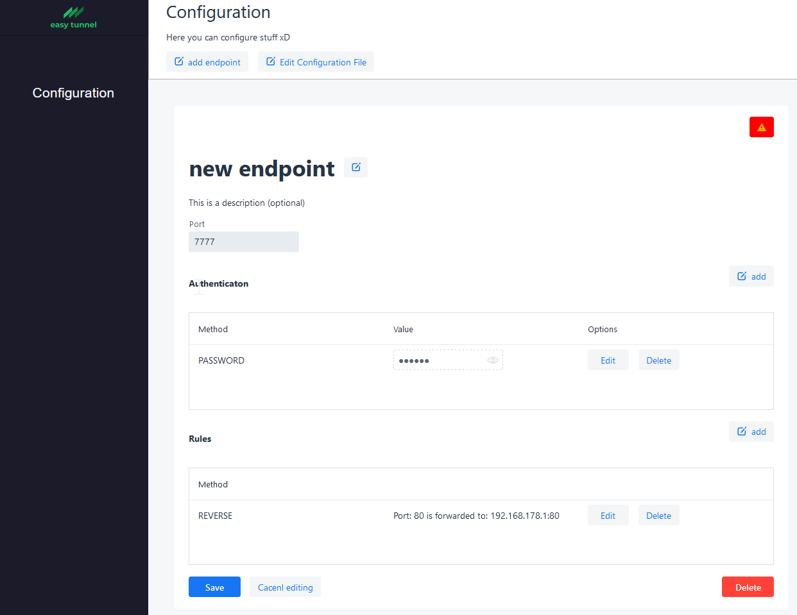

## Important Notice

I started this project as a Java Project with Vaadin Frontend. But two things happened: I wanted to learn the programming language Go, and the project was way more complex than what I actually needed. So, I started from scratch. 
The whole Project should be more modular. A Web-Interface is not planned, instead docker labels or a configuration file will be used. 

Because of study and work, I'm not currently able to continue work on this project. But checkout the current work at dev branch. 

An Overview of the new architecture I planned to implement in the rework I may add later.

# easy_tunnel


An Open Source Project to easily create SSH-Tunnels via an Web Interface.

## Background

---
SSH Tunnel are a perfect way to create a simple connection to a service behind a Firewall or 
to a Server with a changing IP Address. For Example, you have a home server (like a Raspberry Pi) 
running at Home and want to host a simple Nextcloud Instance. To make this Nextcloud instance accessible from anywhere, 
you can be confronted with a variety of Problem.

SSH tunnels will help you when you're facing the following Issues:
- Your ISP not providing you are public IPv4 and IPv6 address
- Your ISP is not providing a static IP-Address
- You are behind a Firewall and cannot create nesseascy firewall rules
- You want to access services in different networks but all with the same IP-Address

All you need is a cheap Server (i.e VPS) with a static IP Address (you can already get VPS for around
1€). Then you have to deploy the easy_tunnel server. On your local Server (for example Raspberry Pi) you
have to install the Client (a simple Java Application). The Java Client then connects to the server, read the 
Configuration and establishes the tunnel. Now you can reach your Service with the static IP Address from your Server (VPS).


## Features

---
* Create and modify SSH-Tunnels within the Web Interface
* Clients auto-reload Configuration from the Server
* Web Interface is optional, you can configure everything with a simple YML File
* You can configure multiple Endpoints independently (what Client can establish what Tunnel)



## Deploying using Docker

To build the Dockerized version of the project, run

```
docker build . -t easy_tunnel:latest
```

Once the Docker image is correctly built, you can test it locally using

```
docker run -p 8080:8080 easy_tunnel:latest
```

### docker-compose 

Compatible with docker-compose v2 schemas.

```yaml
version: "2.1"
services:
  nextcloud:
    image: easy_tunnel:latest
    container_name: easy_tunnel
    environment:
      - haveto:test
    volumes:
      - /path/to/appdata:/config
    ports:
      - 8080:8080
    restart: unless-stopped
```

### Parameters

Container images are configured using parameters passed at runtime (such as those above). These parameters are separated by a colon and indicate `<external>:<internal>` respectively. 
Please note that port 8080 is only for the Web UI. You also have to pass additional ``-p`` parameters for all Ports you like 
to be (reverse)forwarded as well as one port for the SSH Endpoint.

| Parameter | Function |
| :----: | --- |
| `-p 8080` | Web UI |
| `-v /config` | Where the server configuration is stored |
## Running and debugging the application

### Running the application from the command line.
To run from the command line, use `mvn` and open http://localhost:8080 in your browser.

## What next?
